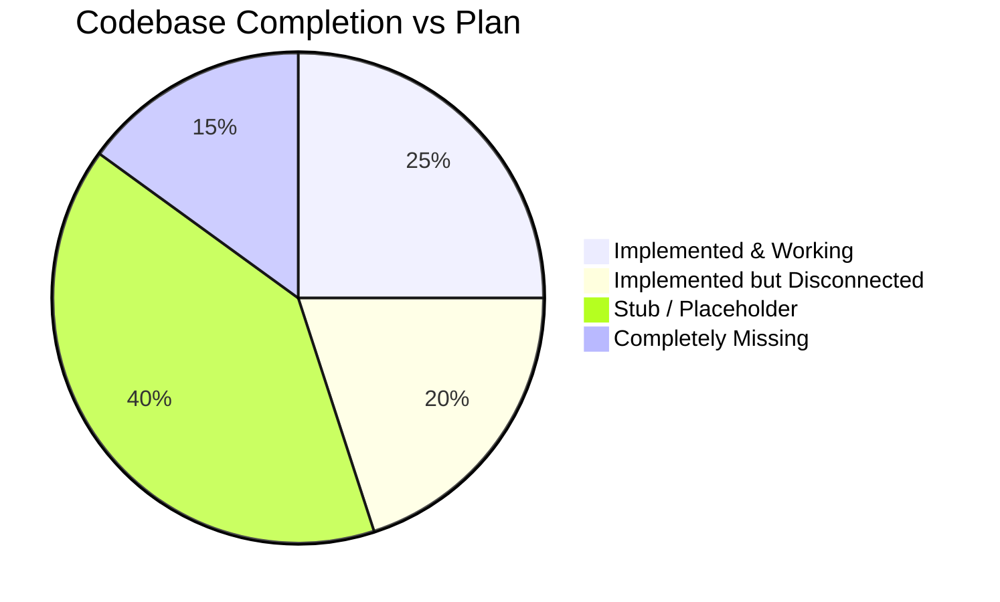
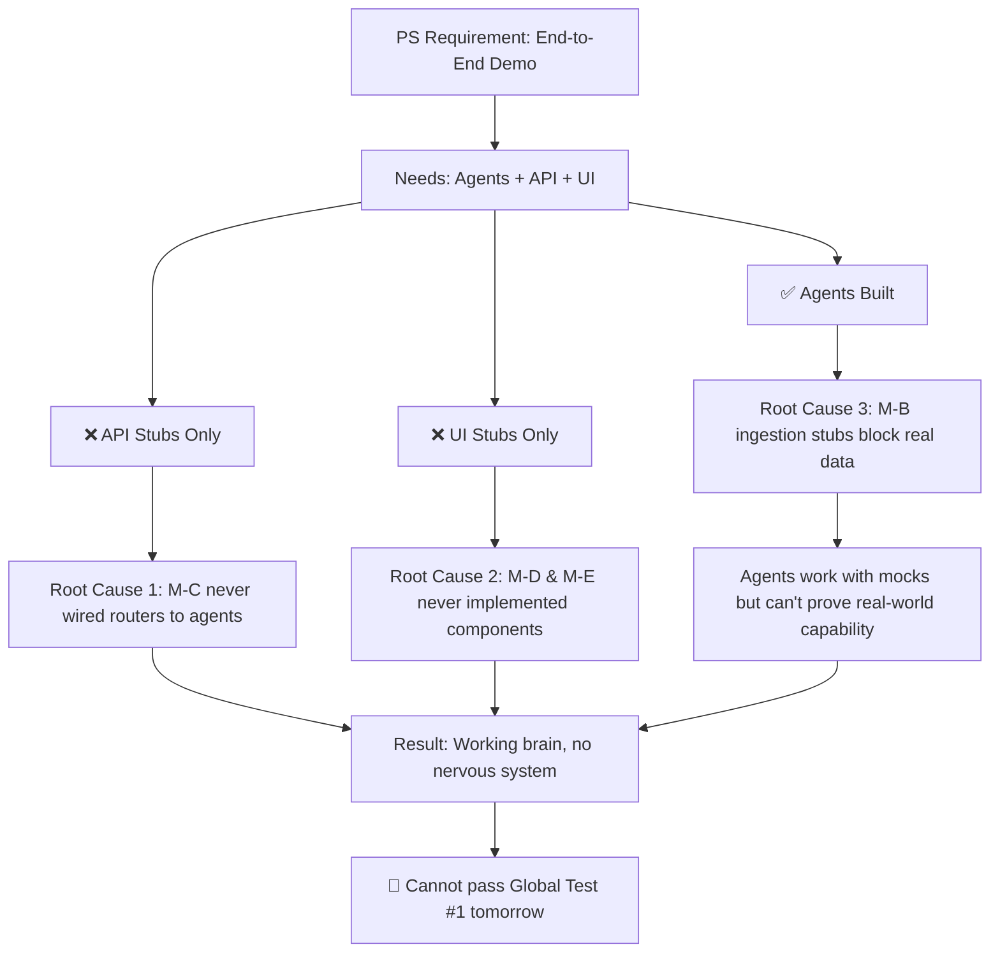

# 🔍 ORCA Marine Intelligence — Codebase Audit Report

**Audit Date:** 04 September 2026  
**Problem Statement:** SIH 2026 #176 (SIH26176) — ISRO / INCOIS  
**Theme:** Space Technology / Disaster Management  
**Submission Deadline:** 20 September 2026  
**Global Test #1:** ~~05 September 2026, 16:00 IST~~ **TOMORROW**

---

## Problem Statement Recap (SIH26176)

> Develop an **Agentic AI-powered conversational platform** that leverages collaborative AI agents, geospatial technologies, and satellite Earth Observation data to provide intelligent, multilingual, conversational decision support for marine fishery applications.

### 8 Mandatory Requirements from ISRO

1. **Natural language intent understanding** — understand fishermen's queries in their own language
2. **Same-language regional replies** — respond in the query's language (22 Indian languages via Bhashini)
3. **Multi-turn conversational refinement** — remember context across turns
4. **Autonomous data discovery** — automatically scrape/ingest INCOIS PFZ data daily
5. **Spatial-temporal reasoning** — proximity, safety, weather, geofencing evaluations
6. **Explainable maps & evidence** — transparent citations and proof for every recommendation
7. **Safety alerts & geofencing** — EEZ, MPA, IMBL warnings; cyclone/wave/wind alerts
8. **Route optimization** — safest navigation path avoiding hazards

---

## Overall Verdict



> [!CAUTION]
> **The codebase has a severe disconnect between its "brain" (agents) and its "body" (API + UI).** The multi-agent intelligence layer is substantially implemented, but it cannot be reached by any user because the API routers are all stubs and the entire frontend is empty placeholders. With Global Test #1 **tomorrow (05 Sep)**, the system cannot serve a single end-to-end request.

---

## Deviation Heatmap: PS Requirements vs Implementation

| # | PS Requirement | Expected | Actual Status | Severity |
|---|---|---|---|---|
| 1 | **Natural Language Intent** | Orchestrator extracts intent, language, location | ✅ Implemented in [orchestrator.py](file:///D:/work/projects/orca-marine-intelligence/backend/agents/orchestrator.py) — but crude keyword matching for 4 languages only | 🟡 Partial |
| 2 | **Same-Language Replies (22 languages)** | Bhashini ULCA integration | ❌ `bhashini-client` commented out in requirements.txt; `bhashini.ts` throws `Error('not yet implemented')`; no translation code exists anywhere | 🔴 **Critical** |
| 3 | **Multi-turn Memory** | Redis session persistence | ✅ [redis.py](file:///D:/work/projects/orca-marine-intelligence/backend/db/redis.py) fully implemented with session save/get/history | 🟢 Done |
| 4 | **Autonomous Data Discovery** | INCOIS scraper, boundary ingester | ❌ [incois_textdata.py](file:///D:/work/projects/orca-marine-intelligence/backend/ingest/incois_textdata.py) raises `NotImplementedError`; [boundaries.py](file:///D:/work/projects/orca-marine-intelligence/backend/ingest/boundaries.py) raises `NotImplementedError` | 🔴 **Critical** |
| 5 | **Spatial-Temporal Reasoning** | 4 parallel agents + combiner scoring | ✅ All 4 agents + combiner + LangGraph supervisor implemented | 🟢 Done |
| 6 | **Explainable Maps & Evidence** | Interactive map with citations | ❌ Frontend [MapView.tsx](file:///D:/work/projects/orca-marine-intelligence/frontend/map/MapView.tsx) returns `"coming soon"`; working prototype exists in [diagrams/map-prototype.html](file:///D:/work/projects/orca-marine-intelligence/diagrams/map-prototype.html) but is NOT integrated | 🔴 **Critical** |
| 7 | **Safety Alerts & Geofencing** | EEZ/MPA/IMBL checks + cyclone/wave/wind | ✅ Agent logic exists, but boundary GeoJSON files (`eez.geojson`, `mpa.geojson`, `imbl.geojson`) are **missing from `data/`**; [SafetyBadge.tsx](file:///D:/work/projects/orca-marine-intelligence/frontend/map/SafetyBadge.tsx) is a stub | 🟡 Partial |
| 8 | **Route Optimization** | Safe navigation path to recommended zone | ❌ No routing logic exists anywhere in the codebase | 🔴 Missing |

---

## Layer-by-Layer Deviation Analysis

### 🧠 Layer 1: Multi-Agent Intelligence (`backend/agents/`) — ✅ STRONGEST LAYER

This is the **only substantially complete layer** and aligns well with the PS requirements.

| File | Status | Notes |
|---|---|---|
| [orchestrator.py](file:///D:/work/projects/orca-marine-intelligence/backend/agents/orchestrator.py) | ✅ Complete | Intent + location extraction, port lookup, delegates to LangGraph |
| [graph.py](file:///D:/work/projects/orca-marine-intelligence/backend/agents/graph.py) | ✅ Complete | LangGraph StateGraph supervisor: planner → fish_discovery → parallel_analysis → decision |
| [fish_finder.py](file:///D:/work/projects/orca-marine-intelligence/backend/agents/fish_finder.py) | ✅ Complete | Staged 80km→120km→160km radius expansion, PostGIS + GeoJSON fallback |
| [sea_checker.py](file:///D:/work/projects/orca-marine-intelligence/backend/agents/sea_checker.py) | 🟡 Mock | Wave/current classification works, but uses MD5 heuristic mock instead of real OSF data |
| [weather_agent.py](file:///D:/work/projects/orca-marine-intelligence/backend/agents/weather_agent.py) | 🟡 Mock | Wind/cyclone logic works, but uses MD5 heuristic mock instead of real IMD data |
| [danger_agent.py](file:///D:/work/projects/orca-marine-intelligence/backend/agents/danger_agent.py) | 🟡 Partial | EEZ/MPA/IMBL checking logic exists, but `data/eez.geojson`, `data/mpa.geojson`, `data/imbl.geojson` files are **missing** |
| [combiner.py](file:///D:/work/projects/orca-marine-intelligence/backend/agents/combiner.py) | ✅ Complete | 40/30/20/10 weighted scoring, citations, all-unsafe detection |

> [!WARNING]
> **Deviation: Mock data instead of real sources.** The PS requires "autonomous data discovery." The agents work correctly with mock/heuristic data, but W1 mocks were supposed to be replaced by real INCOIS/IMD/OSF integrations. The mock data makes demos look functional but won't satisfy ISRO judges who will test with real coordinates and expect real oceanographic conditions.

#### 🔴 Key Agent Deviations:
1. **Only 3 coastal ports hardcoded** (Kochi, Veraval, Chennai) — PS implies coverage of all 14 INCOIS sectors
2. **Bhashini not called** — orchestrator docstring claims Bhashini integration but code only does crude keyword matching for 4 languages
3. **Missing boundary data files** — `danger_agent.py` references `data/eez.geojson`, `data/mpa.geojson`, `data/imbl.geojson` which don't exist

---

### 🔌 Layer 2: API Routers (`backend/routers/` + `main.py`) — ❌ COMPLETELY DISCONNECTED

> [!CAUTION]
> **This is the most critical deviation.** The API layer was supposed to be the "glue" connecting the working agents to the frontend. Instead, it's entirely non-functional.

| File | Status | Issue |
|---|---|---|
| [main.py](file:///D:/work/projects/orca-marine-intelligence/backend/main.py) | ❌ Stub | **All 5 routers commented out**, CORS middleware commented out, only `/health` works |
| [chat.py](file:///D:/work/projects/orca-marine-intelligence/backend/routers/chat.py) | ❌ Stub | Both `POST /api/chat` and `GET /api/chat/history` raise `NotImplementedError` |
| [pfz.py](file:///D:/work/projects/orca-marine-intelligence/backend/routers/pfz.py) | ❌ Stub | Both `GET /api/pfz/today` and `GET /api/pfz/history` raise `NotImplementedError` |
| [weather.py](file:///D:/work/projects/orca-marine-intelligence/backend/routers/weather.py) | ❌ Stub | Both endpoints raise `NotImplementedError` |
| [geofence.py](file:///D:/work/projects/orca-marine-intelligence/backend/routers/geofence.py) | ❌ Stub | Both endpoints raise `NotImplementedError` |
| [tiles.py](file:///D:/work/projects/orca-marine-intelligence/backend/routers/tiles.py) | ❌ Stub | Raises `NotImplementedError` |

**Impact:** Even though the agent intelligence layer is functional, **no HTTP endpoint can reach it**. The FastAPI server only serves `/health → {"status": "ok"}`.

#### Additional API Issues:
- Non-UTF-8 `\x97` byte in docstrings across all router files
- `pyproject.toml` specifies `fastapi>=0.141.1` — this version **does not exist** on PyPI
- `pyproject.toml` vs `requirements.txt` dependency mismatch (`psycopg-binary` vs `asyncpg`)

---

### 📊 Layer 3: Data Pipeline (`backend/ingest/` + `backend/db/`) — 🟡 HALF-BUILT

| Component | Status | Notes |
|---|---|---|
| [schema.sql](file:///D:/work/projects/orca-marine-intelligence/backend/db/schema.sql) | ✅ Complete | 7 tables with GiST spatial indexes |
| [models.py](file:///D:/work/projects/orca-marine-intelligence/backend/db/models.py) | ✅ Complete | SQLAlchemy 2.0 + GeoAlchemy2 ORM models |
| [session.py](file:///D:/work/projects/orca-marine-intelligence/backend/db/session.py) | ✅ Complete | Async engine + session factory |
| [postgis.py](file:///D:/work/projects/orca-marine-intelligence/backend/db/postgis.py) | ✅ Complete | Spatial queries: upsert, find_near, check_geofence |
| [redis.py](file:///D:/work/projects/orca-marine-intelligence/backend/db/redis.py) | ✅ Complete | Cache + session + history with in-memory fallback |
| [incois_textdata.py](file:///D:/work/projects/orca-marine-intelligence/backend/ingest/incois_textdata.py) | ❌ Stub | `raise NotImplementedError` |
| [boundaries.py](file:///D:/work/projects/orca-marine-intelligence/backend/ingest/boundaries.py) | ❌ Stub | `raise NotImplementedError` |
| [copernicus_fallback.py](file:///D:/work/projects/orca-marine-intelligence/backend/ingest/copernicus_fallback.py) | ❌ Stub | `raise NotImplementedError` (planned W5) |

> [!IMPORTANT]
> **The DB layer is well-built but the ingestion pipeline that feeds it is empty.** The database schemas, spatial queries, and Redis caching are production-quality, but nothing can populate the tables because all three ingestion scripts are stubs. The existing `data/pfz-today.geojson` (128 KB, ~437 points) was likely manually created or fetched once, but there's no automated pipeline to refresh it.

---

### 🖥️ Layer 4: Frontend (`frontend/`) — ❌ ENTIRELY EMPTY SCAFFOLD

> [!CAUTION]
> **Every single frontend component is a stub returning "coming soon" text.** The frontend cannot render a map, accept a chat message, display a safety badge, or switch languages. It cannot even build — the mandatory `app/layout.tsx` file is missing.

| File | Status | Returns |
|---|---|---|
| [page.tsx](file:///D:/work/projects/orca-marine-intelligence/frontend/app/page.tsx) | ❌ Stub | `<p>Coming soon — loading map and chat...</p>` |
| [map/page.tsx](file:///D:/work/projects/orca-marine-intelligence/frontend/app/map/page.tsx) | ❌ Stub | `<p>Map page — coming soon</p>` |
| [api/pfz/route.ts](file:///D:/work/projects/orca-marine-intelligence/frontend/app/api/pfz/route.ts) | ❌ Stub | HTTP 501: `{ error: 'PFZ proxy not yet implemented' }` |
| [ChatPanel.tsx](file:///D:/work/projects/orca-marine-intelligence/frontend/chat/ChatPanel.tsx) | ❌ Stub | `<p>ChatPanel — coming soon</p>` |
| [LanguageSwitch.tsx](file:///D:/work/projects/orca-marine-intelligence/frontend/chat/LanguageSwitch.tsx) | ❌ Stub | `<span>LanguageSwitch — coming soon</span>` |
| [bhashini.ts](file:///D:/work/projects/orca-marine-intelligence/frontend/chat/bhashini.ts) | ❌ Stub | `throw new Error('not yet implemented')` |
| [MapView.tsx](file:///D:/work/projects/orca-marine-intelligence/frontend/map/MapView.tsx) | ❌ Stub | `<p>MapView — coming soon</p>` |
| [SafetyBadge.tsx](file:///D:/work/projects/orca-marine-intelligence/frontend/map/SafetyBadge.tsx) | ❌ Stub | `<span>SafetyBadge — coming soon</span>` |
| [geo.ts](file:///D:/work/projects/orca-marine-intelligence/frontend/map/geo.ts) | ❌ Stub | All 4 functions `throw Error('not yet implemented')` |

#### Missing Infrastructure:
- **No `app/layout.tsx`** — Next.js 14 cannot build without it
- **No `tailwind.config.js`** or `postcss.config.js` — Tailwind CSS won't work
- **No `globals.css`** — no base styles
- **No `next.config.js`** — no API rewrites configured
- **No `package-lock.json`** or `node_modules` — dependencies not installed
- **No `@types/leaflet`** — TypeScript will error on Leaflet imports
- **Missing `'use client'` directives** on interactive components

#### Missed Opportunity:
A **working Leaflet prototype** exists at [diagrams/map-prototype.html](file:///D:/work/projects/orca-marine-intelligence/diagrams/map-prototype.html) (rendering all 437 PFZ zones), but its logic has NOT been ported to the React components.

---

### 🏗️ Layer 5: Infrastructure — 🟡 Partial

| File | Status | Notes |
|---|---|---|
| [docker-compose.yml](file:///D:/work/projects/orca-marine-intelligence/infra/docker-compose.yml) | ✅ Complete | PostGIS 16 + Redis 7 + backend container with healthchecks |
| [vercel.json](file:///D:/work/projects/orca-marine-intelligence/infra/vercel.json) | ✅ Complete | Frontend deploy + API rewrite to Render backend |
| [Dockerfile](file:///D:/work/projects/orca-marine-intelligence/backend/Dockerfile) | ✅ Complete | Backend container |
| `.env.example` | ✅ Complete | All required env vars documented |
| Cron automation | ❌ Missing | No `cron_ingest.sh` for daily 11:30 AM pipeline |

---

### 🧪 Layer 6: Testing — 🟡 Comprehensive but Untested

[test_agents.py](file:///D:/work/projects/orca-marine-intelligence/tests/test_agents.py) (803 lines) is **impressively thorough** — covering haversine math, radius expansion, wave/wind classification, geofencing raycasting, combiner scoring, and orchestrator parallel execution. However:
- Tests reference functions and behaviors that match the agent implementations
- No integration tests against the API routers (because they're all stubs)
- No frontend E2E tests

---

### 📚 Layer 7: Documentation & Research — ✅ OVER-INDEXED

The project has **exceptional documentation** — 6 major docs, 5 research papers, 5 member specs, 5 HTML diagrams. The research on multilingual handling is particularly deep:
- 3-tier language identification cascade (Unicode → Phonetic Trie → LLM Joint Pass)
- Provider-agnostic translation layer with circuit breaker failover
- Coastal marine dictionary with vernacular fish species glossary
- Chat API schema prototype with SSE streaming spec

> [!WARNING]
> **The project has invested heavily in planning and documentation while under-investing in implementation.** The ratio of specification-to-code is severely skewed. This is a common deviation pattern: the team has been "building the blueprint" rather than "building the house."

---

## Root Cause Analysis



### The 4 Critical Disconnects:

1. **M-C (API Layer) never connected the dots.** The routers are all commented out in `main.py`. Even uncommenting them won't help — every endpoint raises `NotImplementedError`. The thin wrapper pattern (router → agent function call) was defined in docs but never coded.

2. **M-D + M-E (Frontend) never started.** Despite a working prototype in `diagrams/`, the React components are all "coming soon" stubs. No `layout.tsx`, no Tailwind config, no Leaflet initialization. The frontend literally cannot build.

3. **M-B (Data Pipeline) left ingestion empty.** The DB layer (`models.py`, `postgis.py`, `redis.py`, `schema.sql`) is well-built, but the ingestion scripts that populate it are all `NotImplementedError`. The `data/pfz-today.geojson` file exists as a static artifact but isn't refreshed automatically.

4. **Bhashini integration is completely absent** despite being documented as an MVP-critical requirement. The dependency is commented out, the TypeScript helper throws errors, and the Python orchestrator does crude keyword matching instead of real language detection.

---

## Priority Fix Plan

### 🚨 P0 — Before Global Test #1 (by tomorrow 05 Sep 16:00 IST)

These are the **minimum viable fixes** to demonstrate an end-to-end flow:

#### Fix 1: Wire API Routers (M-C) — ~2 hours
```
1. Uncomment all routers and CORS in backend/main.py
2. Implement POST /api/chat → call orchestrator.orchestrate()
3. Implement GET /api/pfz/today → read data/pfz-today.geojson and return it
4. Fix non-UTF-8 bytes in all router files
5. Fix pyproject.toml version (fastapi>=0.115.0)
```

#### Fix 2: Implement Frontend Shell (M-D + M-E) — ~4 hours
```
1. Create app/layout.tsx with <html> and <body>
2. Create tailwind.config.js, postcss.config.js, globals.css
3. Port diagrams/map-prototype.html → MapView.tsx (use next/dynamic SSR: false)
4. Build minimal ChatPanel with text input → POST /api/chat → display reply
5. Build minimal SafetyBadge with green/yellow/red logic
6. Wire app/page.tsx shell: 30% chat + 70% map
7. Implement api/pfz/route.ts to proxy backend or serve static GeoJSON
```

#### Fix 3: Add Basic Language Detection (M-A + M-E) — ~1 hour
```
1. Implement Unicode range detection in bhashini.ts (Malayalam, Tamil, Telugu, etc.)
2. Pass detected language through to orchestrator
3. At minimum, echo back responses with the detected language code
```

### ⚡ P1 — Before Code Freeze (by 12 Sep 16:00 IST)

#### Fix 4: Implement INCOIS Ingestion (M-B) — ~4 hours
```
1. Implement incois_textdata.py: session cookie → 14 sector fetch → HTML parse → DMS convert → GeoJSON
2. Implement boundaries.py: download MarineRegions EEZ + WDPA MPA → PostGIS
3. Create missing data/eez.geojson, data/mpa.geojson, data/imbl.geojson for fallback
4. Build cron_ingest.sh for daily 11:30 AM automation
```

#### Fix 5: Implement Real Bhashini/Translation (M-A + M-E) — ~3 hours
```
1. Uncomment bhashini-client in requirements.txt
2. Implement the 3-tier cascade: Unicode → Keyword → LLM Joint Pass
3. Implement provider-agnostic translate() with circuit breaker
4. Wire LanguageSwitch.tsx with 22-language dropdown
```

#### Fix 6: Implement SSE Streaming Chat (M-C + M-E) — ~3 hours
```
1. Implement POST /api/chat/stream with SSE event types
2. Update ChatPanel to consume SSE stream with progressive rendering
3. Add evidence citations display in chat bubbles
```

#### Fix 7: Connect Real Weather Data (M-A + M-B) — ~4 hours
```
1. Implement fetch_osf_wave_current in sea_checker.py (OSF 06Z Zarr data)
2. Implement fetch_imd_wind in weather_agent.py (IMD API)
3. Replace MD5 heuristic mocks with real data connectors
```

### 🔧 P2 — Before Submission (by 20 Sep)

- Vector tiles (`ST_AsMVT`) for low-bandwidth optimization
- pgRouting safety-weighted navigation paths
- Service worker offline caching
- SMS generation in vernacular
- Multi-turn conversation polish
- Mobile responsive layout

---

## File-Level Deviation Summary

| Member | Lane | Files Expected | Files Implemented | Files Stub/Missing | Completion |
|---|---|---|---|---|---|
| **M-A** | Agents | 7 | 7 (orchestrator, graph, combiner, fish_finder, sea_checker, weather, danger) | 0 (but mocks instead of real data) | **~85%** |
| **M-B** | Data | 8 | 5 (schema, models, session, postgis, redis) | 3 (incois_textdata, boundaries, copernicus) | **~55%** |
| **M-C** | API | 8 | 1 (main.py partial) | 7 (all routers + CORS + lifespan) | **~10%** |
| **M-D** | Map | 6 | 0 | 6 (all stubs) | **~0%** |
| **M-E** | Chat | 5 | 0 | 5 (all stubs) | **~0%** |

---

## Summary: What's Wrong and What to Do

> [!IMPORTANT]
> **The project has a brilliant brain with no body.** The multi-agent reasoning layer (M-A) is well-implemented and the database layer (M-B partial) is solid. But the API bridge (M-C), map visualization (M-D), and chat interface (M-E) are entirely empty scaffolds. The result is a system that can *think* but cannot *speak* or *show*.

### The 3 Things That Must Happen Before Tomorrow:
1. **Wire `main.py` → routers → agents** (turn `/api/chat` from `NotImplementedError` into a working endpoint)
2. **Port `map-prototype.html` → `MapView.tsx`** (leverage the existing working prototype)
3. **Build a minimal chat input → API → response flow** (even without streaming, a sync POST is enough for demo)

### The 3 Things That Must Happen Before Code Freeze:
1. **Implement INCOIS scraper** — without it, the "autonomous data discovery" requirement fails
2. **Implement Bhashini/translation** — without it, the "same-language reply" requirement fails
3. **Replace weather/ocean mocks** — without it, the "real-time safety assessment" claim is hollow

The documentation and research are excellent. The architecture is sound. The agent logic is solid. **The project just needs to execute on implementation now** — no more planning, no more docs, pure coding against the existing specs.
