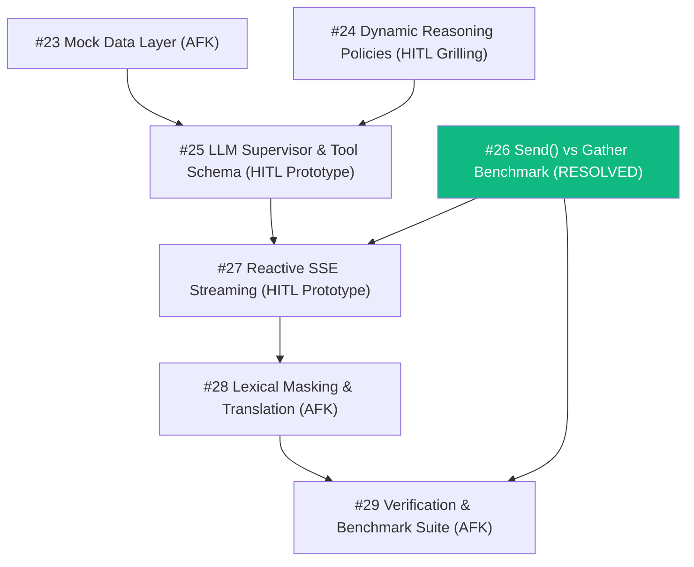

## Destination

Transform ORCA's multi-agent system into a true dynamic reasoning Agentic AI platform featuring an LLM-driven Supervisor/Planner agent, autonomous tool selection across specialized sub-agents, reactive event-driven SSE streaming, grounded multilingual synthesis, and a pluggable, scenario-controllable mock data fetching layer for INCOIS, OSF, IMD, and PostGIS geofences.

## Notes

- Domain: ISRO SIH26176 — ORCA Marine Ecosystem Reasoning with Collaborative Agents.
- Member Ownership: M-A (Agents & Orchestration in `backend/agents/`) & M-B (Data & Mocking in `backend/ingest/`).
- Dual-Mode Operation: Both HITL (human-in-the-loop grilling & prototyping) and AFK (autonomous research & task execution) tickets.
- Core Invariant: Shared candidate GeoJSON coordinates passed concurrently to safety sub-agents.
- Non-negotiable Latency Target: P95 < 2.0s with graceful degradation (0.87 -> 0.62 confidence) if external/LLM calls exceed thresholds.

## Decisions so far

- [Design Intent Routing & Landmark Resolution](https://github.com/parth5012/orca-marine-intelligence/issues/8) — independent intent flags, COASTAL_PORTS fast-path, Redis session memory.
- [Define Multi-Factor Scoring Formulation](https://github.com/parth5012/orca-marine-intelligence/issues/9) — 40/30/20/10 weighted formula, all_unsafe DO NOT SAIL.
- [Define Server-Sent Events (SSE) Protocol](https://github.com/parth5012/orca-marine-intelligence/issues/11) — status -> map -> safety -> tokens -> evidence -> done.
- [Implement Multi-Agent Orchestration in graph.py](https://github.com/parth5012/orca-marine-intelligence/issues/16) — LangGraph supervisor StateGraph baseline.
- [Benchmark LangGraph Send() Fan-Out vs asyncio.gather for Dynamic Sub-Agent Tool Execution](https://github.com/parth5012/orca-marine-intelligence/issues/26) — Send() overhead is negligible (+5ms / 0.25% SLA budget), provides full LangSmith waterfall tracing & unlocks native astream_events SSE streaming; timeout must be tightened from 10s to 1.4s to guarantee P95<2.0s SLA.

## Next Wayfinder Map

- [Map 30: Full Dynamic LLM Reasoning Implementation](file:///D:/work/projects/orca-marine-intelligence/docs/ORCA_Wayfinder_Map_30_LLM_Reasoning_Implementation.md) — Follow-up AFK implementation plan spawned from Ticket #24 grilling.

## Completed Tickets in Map 22

- [#23 Pluggable Mock Data Fetching Layer](https://github.com/parth5012/orca-marine-intelligence/issues/23) (commit `9c399ab`)
- [#24 Dynamic Agentic Reasoning Policies & Grilling](https://github.com/parth5012/orca-marine-intelligence/issues/24) (Resolved via architecture spec)
- [#25 Prototype Dynamic LLM Supervisor Schema](https://github.com/parth5012/orca-marine-intelligence/issues/25) (commit `1795676`)
- [#26 Send() Fan-out Benchmark](https://github.com/parth5012/orca-marine-intelligence/issues/26) (Resolved)
- [#27 Prototype Reactive SSE Streaming](https://github.com/parth5012/orca-marine-intelligence/issues/27) (commit `1795676`)
- [#28 Marine Lexical Masking & Vernacular Grounding](https://github.com/parth5012/orca-marine-intelligence/issues/28) (commit `f046ebc`)
- [#29 Dynamic Agentic Reasoning Verification Suite](https://github.com/parth5012/orca-marine-intelligence/issues/29) (commit `d3067f5`)

## Dependency Graph

## Not yet specified

- Real-time Sentinel-3 / MODIS chlorophyll-a raster dynamic fusion (Week 5).
- AIS vessel traffic corridor collision avoidance.
- High-frequency edge voice audio pipeline (post-MVP).

## Out of scope

- Direct browser connections to INCOIS or IMD APIs (must route through server).
- Direct modifications to frontend Map/Chat UI (owned by M-D and M-E).
- Autonomous vessel steering hardware.
