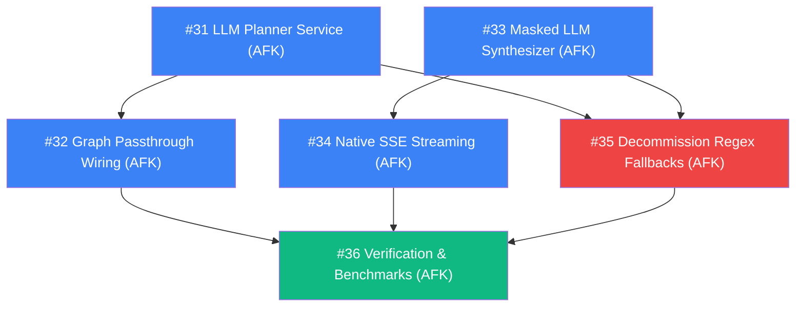

## Destination

Implement full dynamic LLM reasoning within the ORCA multi-agent architecture (ISRO SIH26176) by integrating Gemini 2.5 Flash for the Supervisor/Planner and the Decision Agent Synthesizer. Decommission silent deterministic regex fallbacks, enforce strict safety veto invariants ("Code Trumps LLM"), maintain the restructured `backend/agents/subagents/` layout, and stream real-time tokens under the P95 < 2.0s latency SLA.

## Notes

- **Domain**: ISRO SIH26176 — ORCA Marine Ecosystem Reasoning with Collaborative Agents.
- **Member Ownership**: M-A (Agents & Orchestration in `backend/agents/`).
- **Execution Mode**: 100% AFK (Autonomous Execution by Agent) — all HITL architectural decisions resolved in Ticket #24.
- **Strict Invariant 1 (Code Trumps LLM)**: PostGIS/GIS data retrieval and the 40/30/20/10 multi-factor scoring formula with hard safety veto (`all_unsafe` -> `DO NOT SAIL`) remain strictly deterministic.
- **Strict Invariant 2 (No Silent Fallback)**: Genuine LLM errors/timeouts (>500ms) emit explicit SSE `error` events with transparent user advisories; legacy regex heuristics must NOT mask LLM failures.
- **Subagents Structure**: All 4 specialist agents remain isolated in `backend/agents/subagents/` with backward-compatible facades in `backend/agents/__init__.py`.
- **Latency Target**: P95 < 2.0s across end-to-end SSE streaming pipeline.

## Decisions so far

- [Map 22: Dynamic Agentic Reasoning Framework](file:///D:/work/projects/orca-marine-intelligence/docs/ORCA_Wayfinder_Map_22_Dynamic_Agents.md) — Foundation for dynamic reasoning, SSE ordering, and mock data layer.
- [Ticket #24 Architecture Grilling](file:///C:/Users/DELL/.gemini/antigravity-cli/brain/c61efa5c-463e-491f-b684-993d613ef88f/dynamic_agentic_reasoning_spec.md) — Defined dual LLM boundaries (Planner + Synthesizer), eliminated deterministic regex fallbacks, and enforced masked factual synthesis.
- [Subagents Directory Restructuring](file:///D:/work/projects/orca-marine-intelligence/backend/agents/subagents/) — Isolated `fish_finder`, `sea_checker`, `weather_agent`, and `danger_agent` into `backend/agents/subagents/` with `sys.modules` backward-compatible re-exports.

## Live Child Tickets (Frontier)

### AFK (Autonomous Execution by Agent)

- **#31 M-A: Implement Gemini 2.5 Flash Structured Planner Service** (`wayfinder:task`)
  - Connect Gemini 2.5 Flash with `PlannerOutput` Pydantic schema in `backend/agents/planner_schema.py`.
  - Perform dynamic intent decomposition, coastal landmark geocoding with confidence scoring, and multi-turn context resolution (last 3 turns from Redis).
  - Select minimal specialist tool subsets (`find_fishing_zones`, `check_ocean_state`, `check_weather`, `check_geofence`).
  - Implement clarification threshold gating: if confidence < 0.6, output `needs_clarification=True` and generate dynamic vernacular clarification text.
  - Fail explicitly on timeout (>500ms) or API failure without calling legacy regexes.

- **#32 M-A: Wire LLM Supervisor & Node-Level Passthrough into LangGraph StateGraph** (`wayfinder:task`)
  - Update `planner_node` in `backend/agents/graph.py` to call the LLM Planner Service.
  - Preserve the 4-node topology (`planner -> fish_finder -> parallel_analysis -> decision_agent`).
  - Implement zero-latency (<1ms) passthrough skipping for specialist subagents omitted by the planner.
  - Short-circuit directly to clarification output when `needs_clarification` is flagged.
  - Propagate the planner's `reasoning_trace` into the state and execution evidence.

- **#33 M-A: Implement Masked LLM Advisory Synthesizer in Decision Agent** (`wayfinder:task`)
  - In `backend/agents/graph.py` (`decision_agent`), feed masked metric placeholders (`__MBEARING_0__`, `__MKNOTS_0__`, `__MDIST_0__`) to Gemini 2.5 Flash.
  - Enforce non-negotiable prompt directive: if `all_unsafe=True` or restricted area flagged, mandate `DO NOT SAIL` with explicit risk reasons.
  - Unmask generated text with `unmask_text()` and post-validate safety invariants using `derive_safety_tier()`.
  - Eliminate canned template fallbacks upon LLM failure; raise explicit error states.

- **#34 M-A: Connect Real-Time Native SSE Token Streaming via `on_chat_model_stream`** (`wayfinder:task`)
  - Hook the LLM Advisory Synthesizer directly into `orchestrate_stream_via_graph` in `backend/agents/graph.py`.
  - Stream tokens live as they are generated by the chat model.
  - Enforce strict SSE event ordering: `status* -> map -> safety -> token+ -> evidence -> done`.
  - Buffer early tokens if the provisional map or safety badge events are still pending emission.

- **#35 M-A: Decommission Legacy Regex Fallbacks in Orchestrator & Helpers** (`wayfinder:task`)
  - Clean up `backend/agents/orchestrator.py` by removing legacy active calls to `_parse_intent`, `_resolve_location`, `COASTAL_PORTS`, and `_parse_relative_offset`.
  - Archive pure deterministic utilities in `backend/agents/fallback.py` for edge/offline reference only.
  - Ensure any uncaught LLM error emits an explicit SSE `{"type": "error", "agent": "...", "message": "..."}` rather than silent heuristic fallback.

- **#36 M-A: Dynamic Reasoning Verification Suite & Latency Benchmark** (`wayfinder:task`)
  - Extend `tests/test_dynamic_agents.py` with mock and live LLM fixtures for selective tool execution.
  - Test safety-only queries (skipping `find_fishing_zones`) and clarification paths (low confidence).
  - Verify strict adherence to `all_unsafe` hard vetoes in generated advisories.
  - Verify exact numeric preservation across translations without regional digit corruption.
  - Benchmark full pipeline latency to verify adherence to P95 < 2.0s SLA.

## Dependency Graph

## Not yet specified

- Continuous fine-tuning on regional coastal fishing logbooks (post-MVP).
- Dynamic raster integration for real-time Sentinel-3 chlorophyll-a overlay (Week 5).

## Out of scope

- Direct frontend UI mutations (owned by M-D for Map and M-E for Chat).
- Overriding deterministic PostGIS spatial algorithms or safety veto thresholds with LLM outputs.
