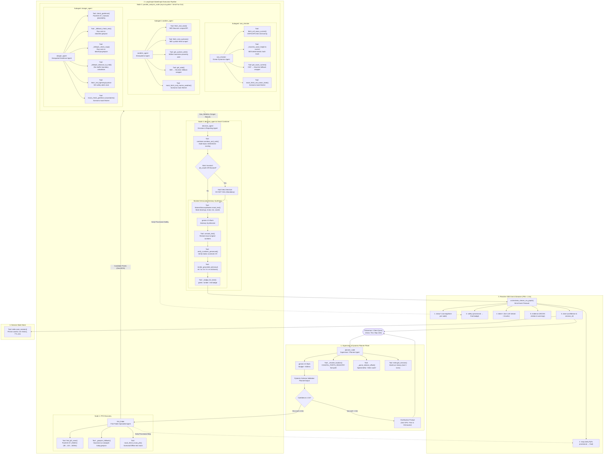
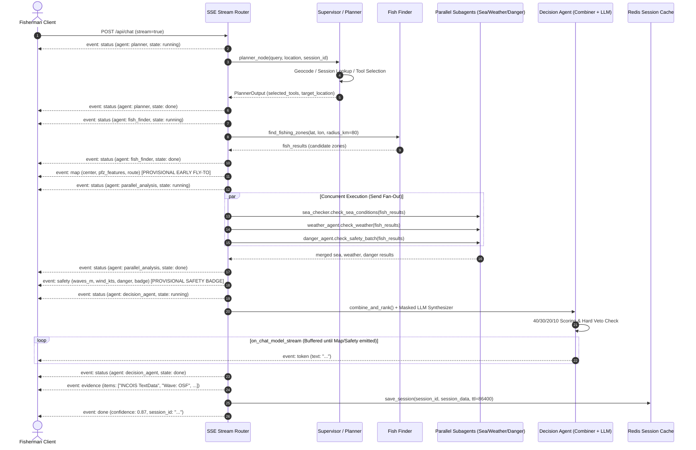

# ORCA Multi-Agent System Architecture & Tools Specification (Map 30)

> **Domain**: ISRO SIH26176 — ORCA Marine Ecosystem Reasoning with Collaborative Agents  
> **Source Guide**: [`docs/ORCA_Wayfinder_Map_30_LLM_Reasoning_Implementation.md`](file:///D:/work/projects/orca-marine-intelligence/docs/ORCA_Wayfinder_Map_30_LLM_Reasoning_Implementation.md) & [`docs/ORCA_Wayfinder_Map_22_Dynamic_Agents.md`](file:///D:/work/projects/orca-marine-intelligence/docs/ORCA_Wayfinder_Map_22_Dynamic_Agents.md)  
> **Owner**: M-A (Agents & Orchestration in [`backend/agents/`](file:///D:/work/projects/orca-marine-intelligence/backend/agents/))

---

## 1. System Architecture Diagram

---

## 2. Agent & Subagent Specifications with Tool Sets

### 2.1 Supervisor / Dynamic Query Planner
* **Source Module**: [`backend/agents/planner_schema.py`](file:///D:/work/projects/orca-marine-intelligence/backend/agents/planner_schema.py) & [`backend/agents/graph.py`](file:///D:/work/projects/orca-marine-intelligence/backend/agents/graph.py#L139-L200)
* **Model**: Gemini 2.5 Flash (`gemini-2.5-flash`)
* **SLA Budget**: `< 500ms`
* **Responsibilities**: Intent decomposition (`wants_fish`, `wants_safety`), multi-turn context resolution, coastal port geocoding, autonomous selective tool subset dispatch (`find_fishing_zones`, `check_ocean_state`, `check_weather`, `check_geofence`), clarification gating.
* **Output Schema**: [`PlannerOutput`](file:///D:/work/projects/orca-marine-intelligence/backend/agents/planner_schema.py#L92-L144) (`target_location`, `intents`, `confidence`, `reasoning_trace`, `selected_tools`).

#### Tools:
| Tool Name | Type | Signature / Purpose | Implementation Details |
| :--- | :--- | :--- | :--- |
| [`_resolve_location`](file:///D:/work/projects/orca-marine-intelligence/backend/agents/orchestrator.py#L94-L104) | Deterministic Geocoder | `(query: str, location: dict \| None) -> tuple[float, float] \| None` | Prioritizes explicit GPS dictionary, then matches against [`COASTAL_PORTS_REGISTRY`](file:///D:/work/projects/orca-marine-intelligence/backend/agents/planner_schema.py#L42-L49) (Kochi, Munambam, Beypore, Kollam, Vizag, Veraval, Chennai). |
| [`_parse_relative_offset`](file:///D:/work/projects/orca-marine-intelligence/backend/agents/orchestrator.py#L113-L120) | Spatial Offset Calculator | `(query: str, cached_lat: float, cached_lon: float) -> tuple[float, float] \| None` | Parses conversational relative directions (e.g., "10km south", "20km further west") using 0.09° per 10km projection. |
| [`redis.get_session`](file:///D:/work/projects/orca-marine-intelligence/backend/db/redis.py) | Memory Lookup | `async (session_id: str) -> dict \| None` | Fetches fisherman's last resolved GPS coordinates, previous zone, vessel type, and turn history. Timeout = 1.0s. |
| `gemini-2.5-flash Structured Planner` | LLM Dispatcher | `(query: str, context: dict) -> PlannerOutput` | Dynamic tool picker with auditable reasoning trace per tool decision. Gated by `confidence >= 0.6`. |

---

### 2.2 Fish Finder Agent (Subagent 1)
* **Source Module**: [`backend/agents/subagents/fish_finder.py`](file:///D:/work/projects/orca-marine-intelligence/backend/agents/subagents/fish_finder.py)
* **Node Name**: `fish_finder`
* **Responsibilities**: INCOIS Potential Fishing Zone (PFZ) discovery, sector filtering (`SEC005`, `KERALA`, etc.), staged radius expansion (80km &rarr; 120km &rarr; 160km).
* **Passthrough Invariant**: If planner omits `find_fishing_zones`, node executes zero-latency passthrough (`<1ms`).

#### Tools:
| Tool Name | Type | Signature / Purpose | Implementation Details |
| :--- | :--- | :--- | :--- |
| [`find_pfz_near`](file:///D:/work/projects/orca-marine-intelligence/backend/db/postgis.py) | PostGIS Spatial DB Tool | `async (lat: float, lon: float, radius_km: float, limit: int) -> list[dict]` | PostGIS spatial index query using spherical `ST_DWithin` on loaded daily INCOIS PFZ polygons. |
| [`_geojson_fallback`](file:///D:/work/projects/orca-marine-intelligence/backend/agents/subagents/fish_finder.py#L86-L185) | Local Haversine Spatial Tool | `(lat: float, lon: float, radius_km: float, limit: int, sector: str \| None) -> list[dict]` | Offline zero-dependency fallback computing spherical haversine distances directly on `data/pfz-today.geojson`. |
| [`_haversine_km`](file:///D:/work/projects/orca-marine-intelligence/backend/agents/subagents/fish_finder.py#L42-L55) | Mathematical Utility | `(lat1: float, lon1: float, lat2: float, lon2: float) -> float` | WGS84 great-circle distance algorithm using mean earth radius `6371.0088 km`. |
| [`mock_fetch_incois_pfz`](file:///D:/work/projects/orca-marine-intelligence/backend/ingest/mock_fetchers.py) | Testing Mock Tool | `(sector: str, center_lat: float, center_lon: float, count: int) -> dict` | Pluggable mock fetcher returning deterministic GeoJSON envelopes for offline simulation and test suites. |

---

### 2.3 Sea Checker Agent (Subagent 2)
* **Source Module**: [`backend/agents/subagents/sea_checker.py`](file:///D:/work/projects/orca-marine-intelligence/backend/agents/subagents/sea_checker.py)
* **Node Name**: `sea_checker` (runs within [`parallel_analysis_node`](file:///D:/work/projects/orca-marine-intelligence/backend/agents/graph.py#L446-L474))
* **Responsibilities**: Wave height and current speed evaluation at candidate PFZ points.
* **Safety Thresholds**:
  * Wave height `< 1.5m` &rarr; `safe`, `1.5m - 2.5m` &rarr; `caution`, `> 2.5m` &rarr; `danger`.
  * Current `> 2.0 kt` &rarr; `caution`, `> 3.0 kt` &rarr; `danger` (current overrides wave).

#### Tools:
| Tool Name | Type | Signature / Purpose | Implementation Details |
| :--- | :--- | :--- | :--- |
| [`fetch_osf_wave_current`](file:///D:/work/projects/orca-marine-intelligence/backend/agents/subagents/sea_checker.py#L190-L206) | Live Ocean Grid Tool (W2) | `async (lat: float, lon: float) -> tuple[float, float]` | OSF/GOFS 06Z forecast fetcher reading Zarr/xarray wave/current numerical model grids. |
| [`_heuristic_wave_height`](file:///D:/work/projects/orca-marine-intelligence/backend/agents/subagents/sea_checker.py#L157-L175) | Deterministic Hash Mock | `(lat: float \| None, lon: float \| None, zone_id: str, idx: int) -> float` | Stable MD5 integer seed producing deterministic mock wave height `[0.3, 3.8] m`. |
| [`_heuristic_current`](file:///D:/work/projects/orca-marine-intelligence/backend/agents/subagents/sea_checker.py#L177-L184) | Deterministic Hash Mock | `(lat: float \| None, lon: float \| None, zone_id: str, idx: int) -> float` | Stable MD5 integer seed producing deterministic mock current `[0.4, 4.0] kt`. |
| [`get_wave_current`](file:///D:/work/projects/orca-marine-intelligence/backend/agents/subagents/sea_checker.py#L208-L235) | Fallback Wrapper Tool | `async (lat, lon, zone_id, idx) -> tuple[float, float, str]` | Tries OSF live data first; on unconfigured/error, seamlessly degrades to heuristic with source tag. |
| [`mock_fetch_osf_ocean_state`](file:///D:/work/projects/orca-marine-intelligence/backend/ingest/mock_fetchers.py) | Scenario Mock Tool | `(zones: list[dict], scenario: str) -> dict` | Supports scenario injection (`normal`, `rough_seas`, `cyclone_warning`, `border_violation`). |

---

### 2.4 Weather Agent (Subagent 3)
* **Source Module**: [`backend/agents/subagents/weather_agent.py`](file:///D:/work/projects/orca-marine-intelligence/backend/agents/subagents/weather_agent.py)
* **Node Name**: `weather_agent` (runs within [`parallel_analysis_node`](file:///D:/work/projects/orca-marine-intelligence/backend/agents/graph.py#L446-L474))
* **Responsibilities**: Wind speed, wind direction, and cyclone proximity detection.
* **Safety Thresholds**:
  * Wind `< 15 kt` &rarr; `safe`, `15 kt - 25 kt` &rarr; `caution`, `> 25 kt` &rarr; `danger`.
  * Active cyclone within `500 km` &rarr; **mandatory danger** overriding wind.

#### Tools:
| Tool Name | Type | Signature / Purpose | Implementation Details |
| :--- | :--- | :--- | :--- |
| [`fetch_imd_wind`](file:///D:/work/projects/orca-marine-intelligence/backend/agents/subagents/weather_agent.py) | Atmospheric Fetcher (W2) | `async (lat: float, lon: float) -> tuple[float, str]` | IMD Mausam API/scraper returning wind speed in knots and 8-point compass direction. |
| [`fetch_imd_cyclones`](file:///D:/work/projects/orca-marine-intelligence/backend/agents/subagents/weather_agent.py#L179-L188) | Storm Warning Feed (W2) | `async () -> list[dict]` | Scrapes active cyclone advisories and storm centers from IMD cyclone bulletin. |
| [`get_cyclone_alert`](file:///D:/work/projects/orca-marine-intelligence/backend/agents/subagents/weather_agent.py#L218-L260) | Proximity Distance Tool | `async (lat, lon, cyclones) -> tuple[bool, float \| None, str \| None, dict \| None]` | Calculates haversine distance to all active storm centers; triggers warning if distance &le; 500 km. |
| [`get_wind`](file:///D:/work/projects/orca-marine-intelligence/backend/agents/subagents/weather_agent.py#L190-L216) | Fallback Wrapper Tool | `async (lat, lon, zone_id, idx) -> tuple[float, str, int \| None, str]` | Extensible wrapper routing to live IMD wind or deterministic mock heuristic. |
| [`mock_fetch_imd_marine_weather`](file:///D:/work/projects/orca-marine-intelligence/backend/ingest/mock_fetchers.py) | Scenario Mock Tool | `(zones: list[dict], scenario: str) -> dict` | Scenario controllable atmospheric mock. |

---

### 2.5 Danger Watch Agent (Subagent 4)
* **Source Module**: [`backend/agents/subagents/danger_agent.py`](file:///D:/work/projects/orca-marine-intelligence/backend/agents/subagents/danger_agent.py)
* **Node Name**: `danger_agent` (runs within [`parallel_analysis_node`](file:///D:/work/projects/orca-marine-intelligence/backend/agents/graph.py#L446-L474))
* **Responsibilities**: International Maritime Boundary Line (IMBL), Marine Protected Areas (MPA), and Indian Exclusive Economic Zone (EEZ) compliance.
* **Safety Invariants**:
  * Inside Marine Protected Area (MPA) &rarr; **`danger` (strictly banned)**.
  * Outside Indian EEZ &rarr; **`danger` (illegal)**.
  * Within `2.0 km` of IMBL or EEZ boundary &rarr; **`caution` (risk of border crossing)**.

#### Tools:
| Tool Name | Type | Signature / Purpose | Implementation Details |
| :--- | :--- | :--- | :--- |
| [`check_geofence`](file:///D:/work/projects/orca-marine-intelligence/backend/db/postgis.py) | PostGIS Geofence Tool | `async (lat: float, lon: float) -> dict` | High-performance PostGIS `ST_Contains` query against `eez_boundaries` and `mpa_boundaries` with 10s timeout. |
| [`_fallback_check_eez`](file:///D:/work/projects/orca-marine-intelligence/backend/agents/subagents/danger_agent.py#L340-L369) | Ray-Casting Spatial Tool | `(lat: float, lon: float) -> tuple[bool, float \| None]` | Ray-casting point-in-polygon verification against cached `data/eez.geojson` multipolygons. |
| [`_fallback_check_mpa`](file:///D:/work/projects/orca-marine-intelligence/backend/agents/subagents/danger_agent.py#L371-L391) | Ray-Casting MPA Tool | `(lat: float, lon: float) -> tuple[bool, str \| None]` | Tests containment against cached `data/mpa.geojson` features, returning MPA name. |
| [`_fallback_distance_to_imbl`](file:///D:/work/projects/orca-marine-intelligence/backend/agents/subagents/danger_agent.py#L393-L411) | Distance-to-Boundary Tool | `(lat: float, lon: float) -> float \| None` | Minimum segment distance calculation to IMBL/EEZ border coordinates to detect 2km buffer. |
| [`fetch_imd_lightning_alert`](file:///D:/work/projects/orca-marine-intelligence/backend/agents/subagents/danger_agent.py#L425-L428) | Severe Weather Stub | `async (lat: float, lon: float) -> dict \| None` | Severe storm and lightning alert integration stub (W2). |
| [`check_safety_batch`](file:///D:/work/projects/orca-marine-intelligence/backend/agents/subagents/danger_agent.py#L671-L680) | Concurrent Point Batcher | `async (points: list) -> list[dict]` | Evaluates shared candidate points concurrently via `asyncio.gather`. |

---

### 2.6 Decision Agent & Smart Combiner
* **Source Module**: [`backend/agents/combiner.py`](file:///D:/work/projects/orca-marine-intelligence/backend/agents/combiner.py), [`backend/agents/lexical_mask.py`](file:///D:/work/projects/orca-marine-intelligence/backend/agents/lexical_mask.py), & [`backend/agents/graph.py`](file:///D:/work/projects/orca-marine-intelligence/backend/agents/graph.py#L328-L440)
* **Node Name**: `decision_agent`
* **Responsibilities**: Multi-factor scoring formula, hard safety veto enforcement, masked vernacular advisory generation, citation and evidence packaging.
* **Deterministic Scoring Formula**:
  $$\text{score} = (\text{closest} \times 0.4) + (\text{safe\_sea} \times 0.3) + (\text{wind\_ok} \times 0.2) + (\text{not\_banned} \times 0.1)$$
  * $\text{closest} = 1.0 - (\text{dist\_km} / \text{max\_dist})$
  * $\text{safe\_sea} = 1.0 \text{ if wave } < 1.5\text{m, else } \max(0.0, 1.0 - (\text{wave} - 1.5)/1.5)$
  * $\text{wind\_ok} = 1.0 \text{ if wind } < 15\text{kt, else } \max(0.0, 1.0 - (\text{wind} - 15)/15)$
  * $\text{not\_banned} = 0.0 \text{ if inside MPA or outside EEZ, else } 1.0$
* **Strict Invariant ("Code Trumps LLM")**:
  * If $\text{not\_banned} == 0.0$ or all spots unsafe &rarr; `all_unsafe = True`, mandatory directive: **`DO NOT SAIL`**. LLM cannot override this rule.

#### Tools:
| Tool Name | Type | Signature / Purpose | Implementation Details |
| :--- | :--- | :--- | :--- |
| [`combine_and_rank`](file:///D:/work/projects/orca-marine-intelligence/backend/agents/combiner.py#L126-L216) | Multi-Factor Combiner Tool | `(fish, sea, weather, danger, user_location, detected_language) -> dict` | Joins specialist outputs on `zone_id`, computes composite scores, evaluates tie-breakers (lower wave &rarr; closer distance), formats evidence and citations. |
| [`MarineGlossaryMasker`](file:///D:/work/projects/orca-marine-intelligence/backend/agents/lexical_mask.py#L56-L90) | Lexical Masker Tool | `mask_text(text: str) -> tuple[str, dict]` | Replaces bearings (`__MBEARING_0__`), knots (`__MKNOTS_0__`), distances (`__MDIST_0__`), and coordinates (`__MCOORD_0__`) with token-safe ASCII tokens before LLM synthesis. |
| `gemini-2.5-flash Advisory Synthesizer` | LLM Synthesizer | `(masked_prompt: str) -> str` | Generates natural language advisory while strictly preserving masked placeholders. Mandatory directive for `DO NOT SAIL` if `all_unsafe=True`. |
| [`unmask_text`](file:///D:/work/projects/orca-marine-intelligence/backend/agents/lexical_mask.py#L58) | Metric Unmasker Tool | `unmask_text(masked_text: str, mask_map: dict) -> str` | Restores original exact numeric values and units into generated text. |
| [`verify_numbers_preserved`](file:///D:/work/projects/orca-marine-intelligence/backend/agents/lexical_mask.py#L65) | Verification Audit Tool | `(original: str, rendered: str) -> bool` | Audits that every number in the ground truth exists identically in rendered advisory without corruption. |
| [`has_regional_digits`](file:///D:/work/projects/orca-marine-intelligence/backend/agents/lexical_mask.py#L64) | Script Purity Tool | `(text: str) -> bool` | Ensures no Indic/regional digits (e.g. Malayalam/Tamil script numbers) corrupted Arabic digits `0-9` (fishermen need Arabic digits for GPS/sonar screens). |
| [`render_grounded_advisory`](file:///D:/work/projects/orca-marine-intelligence/backend/agents/lexical_mask.py#L60) | Vernacular Template Engine | `(lang: str, zone_data: dict, safe_status: str) -> str` | Offline deterministic template grounding engine covering `en`, `ml` (Malayalam), `ta` (Tamil), `te` (Telugu), `hi` (Hindi). |
| [`_badge_for_best`](file:///D:/work/projects/orca-marine-intelligence/backend/agents/orchestrator.py#L107) | Safety Badge Classifier | `(best: dict, sea_s: str, wind_s: str, danger_s: str) -> str` | Produces tri-state badge: `green` (all safe), `amber` (caution/unknown), `red` (danger/DO NOT SAIL). |

---

## 3. Server-Sent Events (SSE) Streaming Sequence

To fulfill the **P95 < 2.0s latency SLA** and the strict ordering contract defined in [`docs/API.md`](file:///D:/work/projects/orca-marine-intelligence/docs/API.md):

---

## 4. Architectural Invariants Summary

1. **Code Trumps LLM**:
   * PostGIS spatial geofencing and the 40/30/20/10 scoring formula with hard safety veto (`all_unsafe` &rarr; `DO NOT SAIL`) are strictly deterministic. LLM cannot override danger classifications.
2. **No Silent Fallbacks**:
   * LLM errors or timeouts (>500ms) emit explicit SSE `error` events with transparent advisories rather than masking failures with regex guesses.
3. **Arabic Numeral Invariant**:
   * Nautical metrics (knots, degrees, bearings, distances) are masked during translation/synthesis and unmasked to guarantee ASCII Arabic digits `0-9` in all languages (`en`, `ml`, `ta`, `te`, `hi`).
4. **Isolated Subagent Directory**:
   * Subagents reside cleanly in [`backend/agents/subagents/`](file:///D:/work/projects/orca-marine-intelligence/backend/agents/subagents/) with backward-compatible facades in [`backend/agents/__init__.py`](file:///D:/work/projects/orca-marine-intelligence/backend/agents/__init__.py).
5. **Strict Latency Budget**:
   * End-to-end P95 &lt; 2.0s enforced via early provisional map streaming (`flyTo`), 1.4s subagent timeouts, and parallel fan-out.
